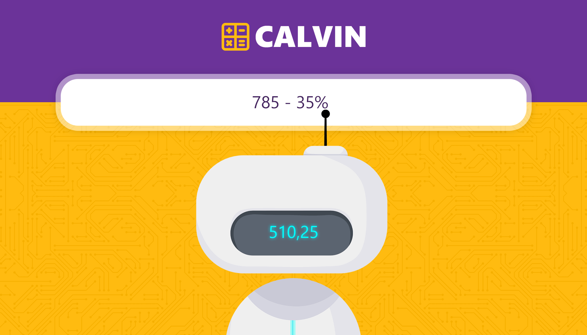

# Calvin Calc
Calculez et convertissez des unités comme une recherche Google.
https://calvin-calc.netlify.app/

## À propros du projet
Je trouvais l'UX des calculatrices et des convertisseurs d'unité cassée, donc j'ai décidé de proposer une solution.

## Fonctionnalités
### Calculatrice
- Calcul avec parenthèse
- Calcul de puissance (2², 2^2 ou 2**2)
- Calcul de pourcentage (258 - 25%)

### Convertisseur d'unité
Ici, j'ai voulu réparer les convertisseurs de temps parce qu'ils renvoies des résultats incorrects (ex: 190 minutes = 3,16 heures au lieu de 3h10). Je voulais aussi une interface permissive donc il est possible d'écrire dans le champs
- "50 cm en in"
- "50 centimètres en inches"

### Stack et dépendance
- React,
- Sass (module),
- [Lodash debounce](https://lodash.com/docs/4.17.15#debounce),
- [Units Converter](https://www.npmjs.com/package/units-converter)
- [Stylelint](https://stylelint.io/)
- [Eslint](https://eslint.org/)
- [ViteJS](https://vitejs.dev/)
- [Bot](https://www.freepik.com/premium-vector/smart-chat-bot-technology-illustration-robot-virtual-assistance-artificial-intelligence-cartoon-flat-illustration_7741471.htm)
- [BGJar](https://bgjar.com/)

## TODO
[] Progressive WebApp
[] Ajout de l'Anglais
